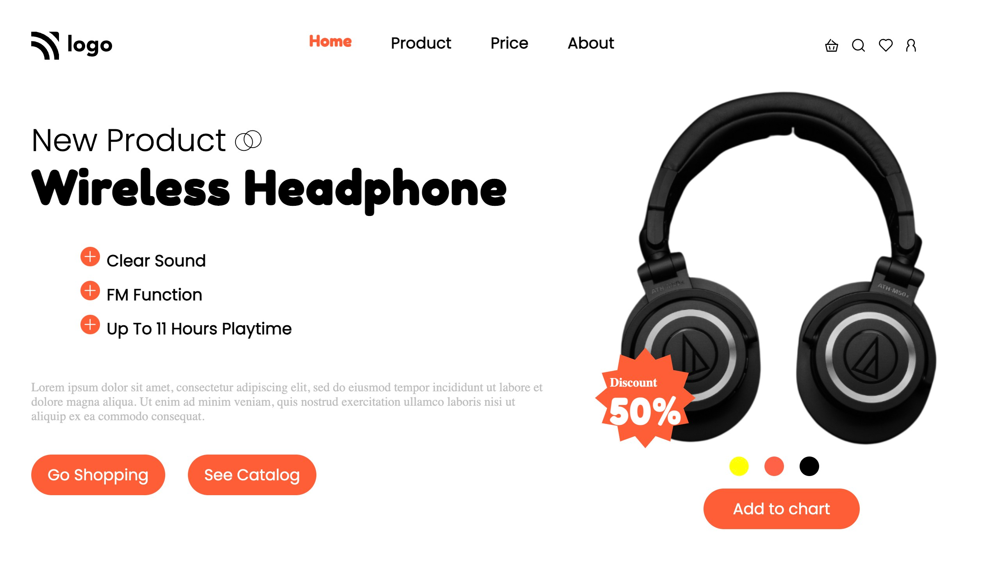

# Law Home Page

- This is a Plant Home page, made using html and css 

## Screenshot

## Note:
- This is not mobile resposive website as of now(made for desktop)

## Built with

- Semantic HTML5 markup
- CSS custom properties
- Flexbox

## What I learned
- I learned how to arrange components with flexbox, I learned how to stick the image to the left margin here, and since this was my first time working with svg, I learned about fill and other svg-related properties while working on this home page.

## Time taken
- It took me around 3 hours to built this website from scratch.

## Links
- [live demo](https://plant-home-page-by-shriram.netlify.app/)
- [source](https://github.com/RAM844/Plant-Home-Page)

## Contact me
- GitHub - [@RAM844](https://github.com/RAM844)
- Twitter - [@ShriramBalaji7](https://www.twitter.com/ShriramBalaji7)